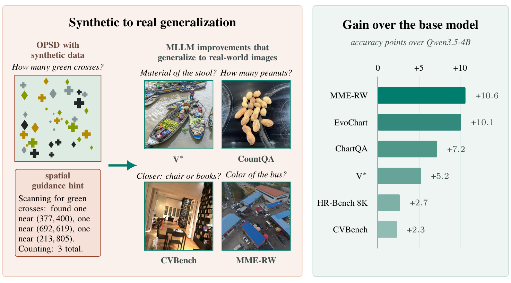

<div align="center">
<h1>
Where-OPD: Spatially Guided On-Policy Self-Distillation of MLLMs with Synthetic Scenes
<br>
</h1>
<br>
<br>
<a href="https://scholar.google.com/citations?user=3ac3PQMAAAAJ&hl=fr">Sophia Sirko-Galouchenko</a>&ensp;
<a href="https://wysoczanska.github.io/">Monika Wysoczanska</a>&ensp;
<a href="https://abursuc.github.io/">Andrei Bursuc</a>&ensp;
<a href="https://thome.isir.upmc.fr">Nicolas Thome</a>&ensp;
<a href="https://scholar.google.com/citations?user=7atfg7EAAAAJ&hl=fr">Spyros Gidaris</a>&ensp;

<p></p>
<a href="https://arxiv.org/abs/2610.02117"></a>
<a href="https://huggingface.co/papers/2610.02117"></a>
<a href="https://huggingface.co/SophiaSirko/WhereOPD-Qwen3.5-4B"></a>



</div>

## Abstract

<em> On-policy self-distillation has recently emerged as an effective approach for improving language-model reasoning by supervising students with a frozen or EMA version of themselves that receives privileged information. Its application to multimodal large language models (MLLMs), however, remains largely unexplored. Recent approaches use privileged visual information, such as image crops corresponding to a question, to improve fine-grained perception, but their gains are confined to tasks that benefit from such visual zooming and require either human-annotated grounding data or external teacher models. We introduce a different form of on-policy self-distillation for MLLMs that provides the teacher with textual, spatially grounded guidance identifying the visual elements relevant to a query. We use procedurally generated scenes with automatically available object identities and spatial coordinates, enabling scalable and annotation-free post-training. The teacher uses this spatial guidance to locate and integrate evidence from multiple relevant image regions, while the student learns to reproduce the resulting behavior from the image and question alone. Our approach consistently improves performance on counting, document and chart understanding benchmarks across multiple models. Importantly, although post-training uses only synthetic scenes, the resulting improvements transfer to real-world perception benchmarks, yielding a 3.23-point gain in average performance across CVBench, V*, ZoomBench, BLINK, HR-Bench, and MME-RealWorld. These results show that spatially grounded privileged information can induce broader perceptual capabilities through on-policy self-distillation, enabling substantial synthetic-to-real transfer beyond the task and data distribution used for post-training. 

 </em>

---

## Environment

```bash
git clone https://github.com/sirkosophia/Where-OPD.git
cd Where-OPD
python -m venv ./envs/where-opd
source ./envs/where-opd/bin/activate

pip install -r requirements.txt       
pip install --no-build-isolation flash-attn==2.8.3 causal-conv1d==1.6.1  
pip install -e .
```
Training was run on 4x H100 (80 GB) per job.

## Datasets

The training data is generated, not downloaded. See [whereopd_data/README.md](whereopd_data/README.md).

```bash
cd whereopd_data
python build_dataset.py build whereopd_count_open_3k --root /path/to/whereopd_data
```

This one command writes both training sets.

| Dataset | Used for |
|---|---|
| `whereopd_count_mcq_3k` | Qwen3.5-4B |
| `whereopd_count_open_3k` | Qwen3.5-9B | 

## Training

The recipe lives in [`verl/trainer/config/whereopd.yaml`](verl/trainer/config/whereopd.yaml)
(loss, where-hint teacher prompt, frozen teacher).
[`scripts/train_whereopd.sh`](scripts/train_whereopd.sh) sets the data, the model and the batch.

```bash
# Qwen3.5-4B
DATA_DIR=/path/to/whereopd_data/whereopd_count_mcq_3k MODEL_PATH=Qwen/Qwen3.5-4B \
  bash scripts/train_whereopd.sh

# Qwen3.5-9B
DATA_DIR=/path/to/whereopd_data/whereopd_count_open_3k MODEL_PATH=Qwen/Qwen3.5-9B \
  bash scripts/train_whereopd_9b.sh
```

Checkpoints are written to `$CHECKPOINT_ROOT/checkpoints/<experiment>/global_step_<N>/`.

## Merge model 

Merge into a Hugging Face model with:

```bash
BASE_DIR=$CHECKPOINT_ROOT/checkpoints/WhereOPD-Qwen3.5-4B/global_step_<N> \
  bash scripts/merge_checkpoint.sh
```
## Model weights

The trained models are on Hugging Face:

| Model | Base |
|---|---|
| [WhereOPD-Qwen3.5-4B](https://huggingface.co/SophiaSirko/WhereOPD-Qwen3.5-4B) | Qwen3.5-4B |
| [WhereOPD-Qwen3.5-9B](https://huggingface.co/SophiaSirko/WhereOPD-Qwen3.5-9B) | Qwen3.5-9B |

Download them into the layout the evaluation scripts expect:

```bash
hf download SophiaSirko/WhereOPD-Qwen3.5-4B --local-dir checkpoints/WhereOPD-Qwen3.5-4B/global_step_31
hf download SophiaSirko/WhereOPD-Qwen3.5-9B --local-dir checkpoints/WhereOPD-Qwen3.5-9B/global_step_62
```
## Evaluation

The judge is Qwen3.5-4B. Download it to `checkpoints/Qwen3.5-4B`
(or point `JUDGE_MODEL_PATH` to an existing model):

```
CHECKPOINTS_DIR=./checkpoints \
MODEL=WhereOPD-Qwen3.5-4B STEP=global_step_31 \
bash scripts/launch_eval_suite.sh
```
## Citation

```
@misc{sirkogalouchenko2026whereopdspatiallyguidedonpolicy,
      title={Where-OPD: Spatially Guided On-Policy Self-Distillation of MLLMs with Synthetic Scenes}, 
      author={Sophia Sirko-Galouchenko and Monika Wysoczanska and Andrei Bursuc and Nicolas Thome and Spyros Gidaris},
      year={2026},
      eprint={2610.02117},
      archivePrefix={arXiv},
      primaryClass={cs.CV},
      url={https://arxiv.org/abs/2610.02117}, 
}
```

## Acknowledgements

This repo builds on the following project:

[Vision-OPD: Learning to See Fine Details for Multimodal LLMs via On-Policy Self-Distillation](https://github.com/VisionOPD/Vision-OPD)

